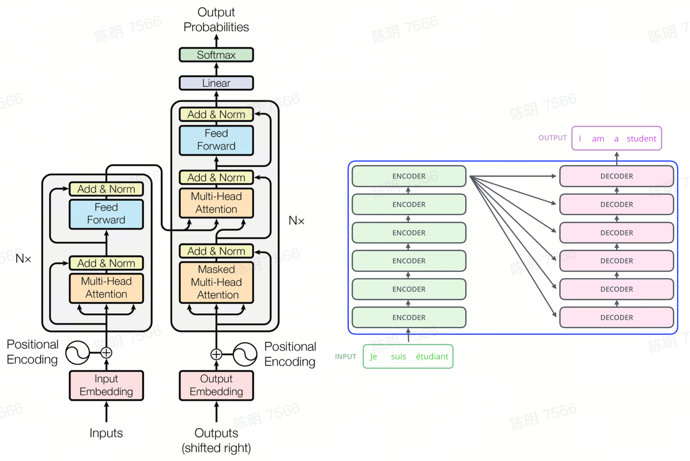
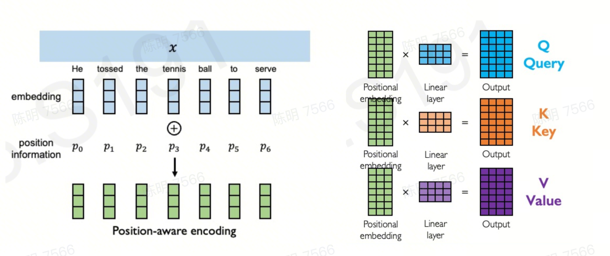
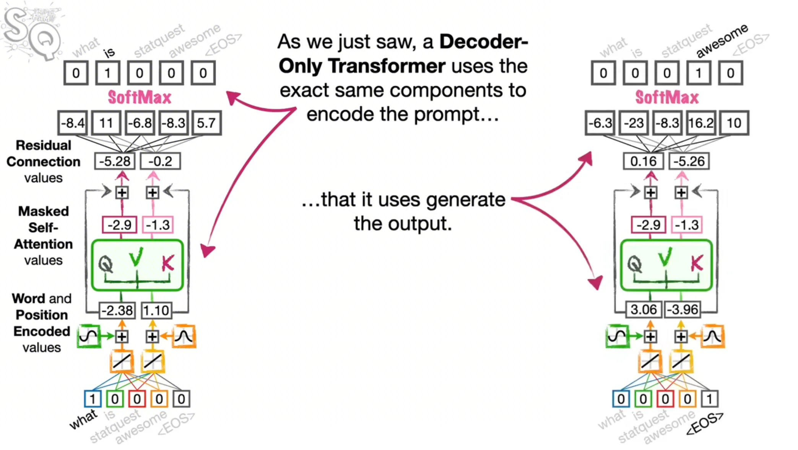
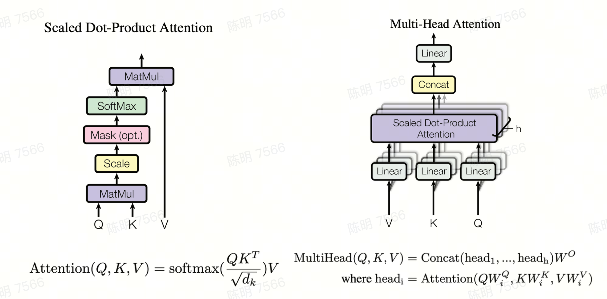
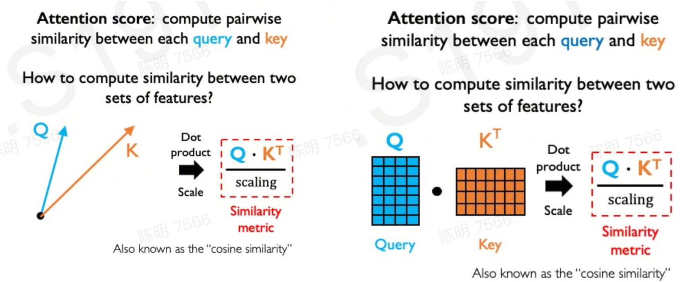
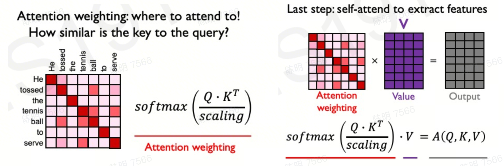
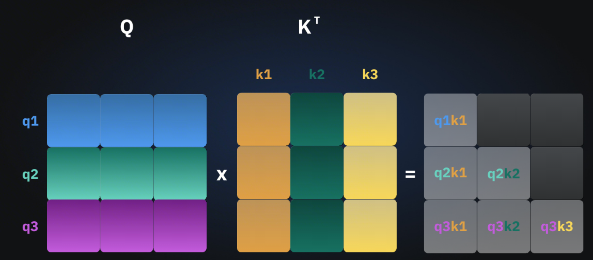
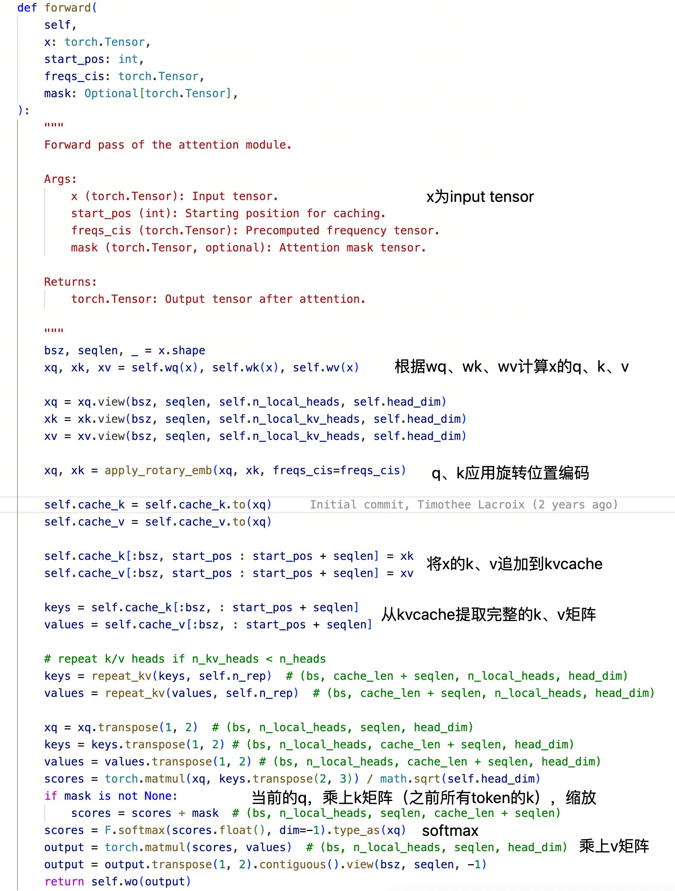
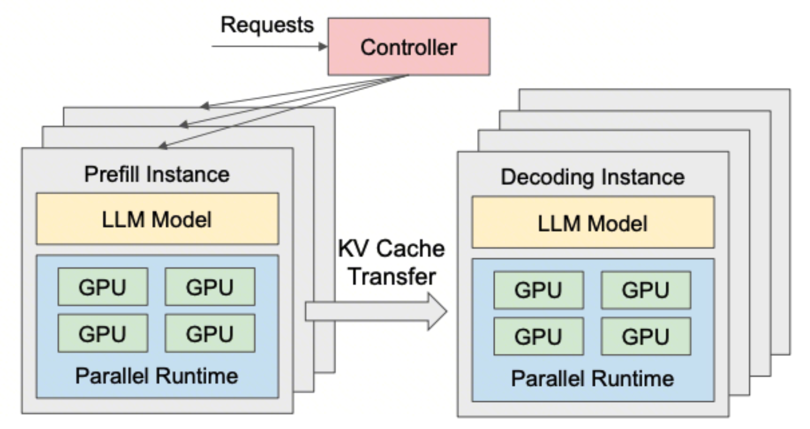
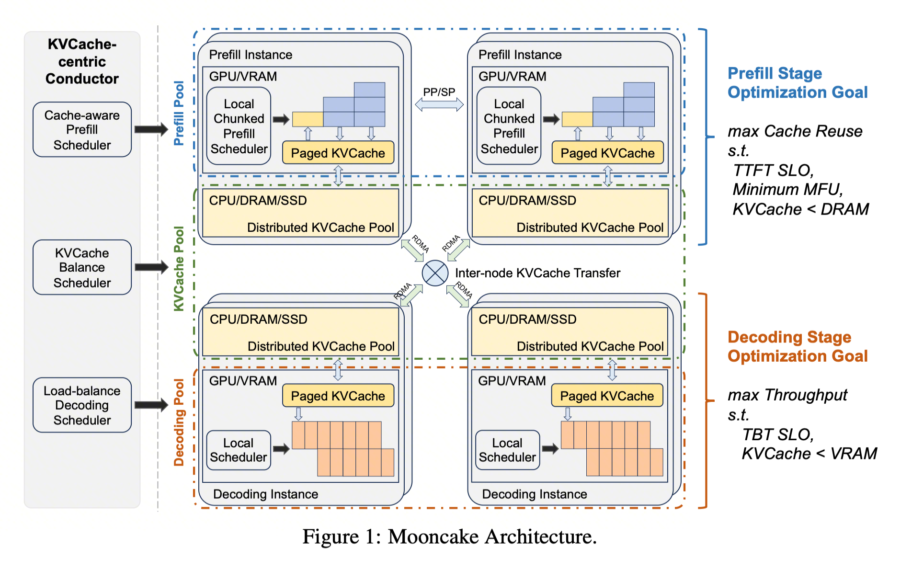

## TL;DR

- KV Cache 是 Transformer 推理的"原罪"（本文结尾会说明它其实是一种"选择"），也是 decode 阶段最主要的内存流量来源之一：causal mask 让历史 K/V 可被安全复用，但显存需求线性增长为 \(2 \cdot L \cdot n_h \cdot d_h \cdot s \cdot \text{dtype_bytes}\)；小 batch decode 的算术强度可低至个位数 FLOP/byte，远低于 A100 的 ~153 FLOP/byte 屋脊点，落在 Roofline 的 memory-bound 区。注意 decode 并非只读 KV——模型权重同样要过一遍 HBM，小 batch 下权重读取本身就是重要瓶颈。
- 单卡装不下的现实：Llama-2-7B 在 128K 上下文下 KV Cache 已达约 64 GB，超过 A100 80GB；Llama-3.1-70B 在 4 并发 × 128K 下需要 160 GB，单张 H200（141 GB）都装不下。
- 架构级压缩：MHA → GQA → MLA 是当前最有效的路线——MQA 将 KV Cache 缩到 \(1/n_h\)，GQA 用 \(n_g/n_h\) 换质量-延迟 Pareto，MLA 通过低秩联合压缩把 DeepSeek-V2 的 KV Cache 砍掉 93.3%。
- 量化 + 驱逐 + 稀疏是并行赛道：KIVI 2-bit 让 Llama-2-7B 显存降 2.6×、吞吐涨 2.35-3.47×；H2O / SnapKV / StreamingLLM 靠 attention sink 和 heavy hitter 做 selection；NVFP4 KV Cache 在长上下文上做到 10.7× 压缩、<1% 精度损失。
- 系统层革命：vLLM 的 PagedAttention 把内存浪费从 60-80% 打到 4% 以下，带来 2-4× 吞吐；SGLang 的 RadixAttention 在前缀重的场景比 vLLM 快 5.6-6.4×；Mooncake 的 KV Cache 池 + Transfer Engine 让 Kimi K2 在 128 卡 H200 上跑到 288k tokens/s decode。
- 未来是从 KV-heavy 到 KV-less：Mamba/RWKV-7/Jamba 等 SSM/混合架构把 decode 内存降到 \(O(1)\) 或大幅缩小，论文报告 Mamba 在长序列、低 batch 下吞吐可达同规模 Transformer 数倍（依模型/硬件/实现而变）；但 SSM 存在近因偏置和 associative recall 短板，Hybrid（Jamba/Zamba/Samba/Griffin）目前是最现实的折衷。

<!--more-->

## 1. 为什么需要 KV Cache：Attention 的记忆诅咒

Transformer 的自注意力被定义为

\[\text{Attention}(Q,K,V)=\text{softmax}\!\left(QK^\top/\sqrt{d_k}\right)V\]

其中 Q/K/V 分别由输入投影得到。在 decoder-only 的自回归生成中，每一步只新增一个 token，因此 Q 每步都要重新计算，但由于 causal mask 阻止未来位置向前看，历史 token 的 K/V 一旦算出便不会再变——这就是 KV Cache 得以存在的数学前提。

这里讨论的主战场是 [decoder-only 架构](https://medium.com/@row3no6/why-chatgpt-uses-decoder-only-eaf0223143e6)，因为 ChatGPT / Llama 这一类自回归模型的 KV Cache 收益最大；如果想看中文语境下对 decoder-only 设计取舍的直观解释，也可以参考这篇[知乎回答](https://www.zhihu.com/question/588325646)。与之对应，encoder-decoder 模型的 cache 结构不同，除了 decoder 侧的自注意力缓存，还会涉及 encoder-decoder cache，Hugging Face 文档对这部分有一段比较清楚的说明：[`encoder-decoder cache`](https://huggingface.co/docs/transformers/kv_cache#encoder-decoder-cache)。

### 1.1 Prefill 与 Decode：两种截然不同的计算特性

一次 LLM 推理天然分成两个阶段：Prefill 用一次前向把整个 prompt 全部编码、拿到第一个 token；Decode 则逐 token 自回归地生成后续 token。二者在 Roofline 图上落到完全不同的区域：

- **Prefill 通常 compute-bound**：一次处理 \(S\) 个 token，矩阵乘的算术强度较高（长 prompt / 大 batch 下可达数百 FLOP/byte），能把 A100/H100 的 Tensor Core 打到接近饱和。但这并非绝对——很短的 prefill、极小 batch 或受限于特定 kernel 时，也可能落在 memory-bound 区。
- **Decode 通常 memory-bound**：每步只算 1 个 token，却要把整个权重和不断长大的 KV Cache 从 HBM 里流一遍，算术强度很低（小 batch 下可低至个位数 FLOP/byte）。具体数值随 batch、context、GQA/MQA、kernel 实现变化，但方向稳定：远低于硬件屋脊点。

关键推论：在 Prefill/Decode 混合的 batch 中，二者会互相拖累——Prefill 的高延迟拉高 Decode 的 TPOT，Decode 的低利用率又拉高整体 TTFT，这直接催生了后文的 P-D 分离架构。

### 1.2 KV Cache 把 K/V 的重复投影从 O(n²) 折叠为 O(n)

如果不用 KV Cache，生成第 \(t\) 个 token 时需要重新为前 \(t-1\) 个 token 计算 K/V，整个生成过程中 K/V 投影的重复计算是 \(O(n^2)\)。缓存住 K/V 后，每一步只需为新 token 计算增量 K/V，把 **K/V 投影的总计算量**降到 \(O(n)\)。

这里要严格区分三种"复杂度"，不能笼统说"KV Cache 把推理降到 O(n)"：

- **K/V 投影的重复计算**：从 \(O(n^2)\) → \(O(n)\)（这是 KV Cache 真正省下的部分）。
- **decode attention 的总计算量**：仍是 \(O(n^2)\)——第 \(t\) 步的 \(q_t K_{1:t}^\top\) 仍要与 \(t\) 个历史 token 做点积，生成整个序列累加起来是二次的。
- **KV Cache 存储 / 单步 attention 读取量**：\(O(n)\)（第 \(t\) 步读取 \(t\) 个 token 的 K/V）。

这也是为什么 MQA/MLA 等架构级优化的动机不是"少算"，而是"少读"——decode 阶段的瓶颈永远是 KV 张量的 HBM 读带宽。

## 2. KV Cache 的代价：显存、带宽与 Arithmetic Intensity

### 2.1 显存公式与量级估算

KV Cache 的字节数由如下公式决定：

\[\text{Bytes}_{\text{KV}} = 2 \cdot L \cdot n_{kv} \cdot d_h \cdot s \cdot b \cdot \text{dtype_bytes}\]

其中系数 2 来自 K 和 V 两份张量，\(L\) 是层数，\(n_{kv}\) 是 KV head 数（MHA 时等于 query head 数，GQA/MQA 下更小），\(d_h\) 是 head dim，\(s\) 是序列长度，\(b\) 是 batch。

代入 Llama-3 8B（\(L=32,\ n_{kv}=8,\ d_h=128\)，FP16）在 \(s=4096\) 时约为 0.5 GiB，在 128K 时上升到约 16 GiB。Llama-3-70B 因层数增至 80、KV heads 保持在 8，是典型的 GQA 折衷——在 128K 时单请求 KV Cache 约 40-42 GB，占 A100 80GB 一半以上。

| 模型 | 层数 L | KV heads | Head dim | 4K (FP16) | 32K (FP16) | 128K (FP16) |
|------|--------|----------|----------|-----------|------------|-------------|
| Llama-3 8B (GQA) | 32 | 8 | 128 | ~0.5 GB | ~4 GB | ~16 GB |
| Llama-3 70B (GQA) | 80 | 8 | 128 | ~1.3 GB | ~10 GB | ~40-42 GB |
| Llama-2 7B (MHA) | 32 | 32 | 128 | ~2 GB | ~16 GB | ~64 GB（超 A100 80GB） |
| GPT-3 175B (MHA) | 96 | 96 | 128 | ~18 GB（低置信） | ~144 GB | ~576 GB |
| Llama-3.1 70B @ 4 并发 | 80 | 8 | 128 | ~5.2 GB | ~40 GB | ~160 GB（超 H200 141GB） |

需要注意：Llama-2-7B 采用的是原始 MHA（无 GQA），因此其 KV Cache 在长上下文下比 Llama-3 系列更夸张，这也是“128K on 7B 单卡塞不下”这一常被引用现象的来源。GPT-3 175B 行的数字置信度较低。

### 2.2 带宽与算术强度：为何 Decode 是 Memory-Bound

以 A100 80GB 为例：FP16 Tensor Core 峰值 312 TFLOPS、HBM 带宽 2039 GB/s，屋脊点约为 \(312{,}000/2039 \approx 153\) FLOP/byte。而小 batch decode 一步的算术强度通常很低（个位数 FLOP/byte 量级），落在 Roofline 深处的 memory-bound 区域。实践中从 prefill 切到 decode，算术强度大幅下降，Tensor Core 从接近饱和跌到低利用率区间（具体百分比强依赖 batch、context、kernel 与并行策略，此处不给单一数字）。

**Prefill（compute-bound）**

- 一次处理整个 prompt
- 算术强度随 \(S\) 线性增长
- 单请求即可打满 Tensor Core
- 优化重点：FLOPs 效率

**Decode（memory-bound）**

- 每步生成 1 个 token
- 权重 + KV Cache 全部要过一遍 HBM
- 算术强度很低（小 batch 下可低至个位数 FLOP/byte）
- 优化重点：HBM 带宽 & KV Cache 体积

MQA 论文早在 2019 年就指出这一点：增量解码慢，本质原因是反复加载庞大的 K、V 张量的内存带宽成本。这也奠定了后续 MQA/GQA/MLA、KV 量化、稀疏化等所有优化方向的共同前提——减少 decode 需要读的 KV 字节数。

## 3. KV Cache 优化技术全景：架构、量化、驱逐、稀疏、复用

围绕“如何让 decode 少读点 KV”，业界发展出五条并行赛道：架构级压缩、量化、驱逐、稀疏化、跨请求复用。它们作用的时机不同（离线 / 训练时 / 推理时 / 在线驱逐）、作用的对象也不同（heads / bits / tokens / requests），因此往往可以组合叠加。以下先给出全景矩阵，再逐条展开。

### 3.1 优化方法全景矩阵

| 类别 | 作用时机 | 作用对象 | 代表方法 | 典型收益 | 关键代价 |
|------|----------|----------|----------|----------|----------|
| 架构级 | 预训练 / 微调 | KV heads（跨 head 共享） | MQA、GQA、MLA | MQA: \(1/n_h\)；GQA: \(n_g/n_h\)；MLA: 93.3%↓ | 需重训 or uptrain；精度略降，MLA 需解耦 RoPE |
| 量化 | 推理时（可离线校准） | KV 张量的位宽（bits） | KIVI、KVQuant、FP8、NVFP4 | 2-bit: 显存 2.6×↓ / 吞吐 2.35-3.47×↑；NVFP4: 10.7×↓ | INT4 存在轻微精度损失；<2 bit 精度崩塌 |
| 驱逐 | 在线（生成中动态淘汰） | tokens（少数关键 K/V） | H2O、Scissorhands、SnapKV、PyramidKV、StreamingLLM | 5× 显存↓ 且 4K 无损；32K 上几乎无损 | 依赖 heavy-hitter/sink 假设；长距离依赖任务有风险 |
| 稀疏 | 推理时（query-aware） | KV blocks / channels | Quest、SparQ、FastGen | SparQ: 带宽 8×↓ 无损 | 需额外 relevance 计算；kernel 复杂 |
| 复用 | 请求间 / 会话间 | 整段 KV 前缀（requests） | vLLM APC、RadixAttention、Prompt Caching | SGLang 前缀密场景 5.6-6.4× 吞吐；DeepSeek 缓存价降至 10% | 依赖前缀命中率；RoPE 使 KV 位置敏感 |

### 3.2 架构级：MHA → MQA → GQA → MLA

MHA（Multi-Head Attention）为每个 query head 分配一份 KV head，KV Cache 大小随 head 数线性增长。MQA（Multi-Query Attention）让所有 query heads 共享一份 KV head，把 KV Cache 缩到 MHA 的 \(1/n_h\)，Falcon-7B/40B 是其代表。GQA（Grouped-Query Attention）把 query heads 分成 \(n_g\) 组、每组共享一份 KV head，压缩比为 \(n_g/n_h\)，当 \(n_g=1\) 退化为 MQA、\(n_g=n_h\) 回到 MHA。GQA 论文证明可用原始预训练算力的 5% 进行“向上训练”（uptraining）从 MHA 迁移，且质量接近 MHA、速度接近 MQA。

为什么 GQA 是主流：它在质量-延迟的 Pareto 前沿上比 MQA 更好、比 MHA 便宜得多；Llama 2 (70B)、Llama 3、Qwen2、Mistral 都采用了 GQA（后一条为 low-confidence 观点）。

MLA（Multi-head Latent Attention，DeepSeek-V2/V3）走的是另一条路：用一个低秩联合矩阵把 KV 表示重参数化/低秩压缩成一个更紧凑的潜向量（latent），推理时缓存这个 latent 而非完整 K/V。但它不是"一个小向量替代 K/V 就完事"——标准 RoPE 与低秩压缩不兼容，因此 DeepSeek 采用**解耦 RoPE**：把 K 拆成不带 RoPE 的潜向量部分与带 RoPE 的解耦向量部分，实际缓存 = latent KV + decoupled RoPE 分量。DeepSeek-V3 的具体配置是 \(d_c=512,\ d^R_h=64\)。另一个关键工程 trick 是"矩阵吸收"：推理时把上投影矩阵 \(W_{UK}\) 吸收进 \(W_Q\) 或 \(W_O\)，使 decode 阶段无需重新显式恢复完整 K/V。DeepSeek-V2 报告 MLA 将 KV Cache 压缩约 93.3%。

如果想直接看工程实现，Meta Llama 的参考代码里可以看到缓存张量 `cache_k` / `cache_v` 的更新与读取路径，见 [`llama/model.py`](https://github.com/meta-llama/llama/blob/main/llama/model.py#L253)。

KV Cache 大小对比（\(n_h=128,\ d_h=128\) 的典型高头模型，每 token）：

| 架构 | 每 token KV Cache 维度 | 相对 MHA 压缩比 | 代表模型 |
|------|------------------------|-----------------|----------|
| MHA | \(2 n_h d_h = 32768\) | 1.0× | GPT-3, Llama-1, Llama-2-7B/13B |
| MQA | \(2 d_h = 256\) | 128× | Falcon-7B/40B, PaLM |
| GQA (\(n_g=8\)) | \(2 n_g d_h = 2048\) | 16× | Llama-2-70B, Llama-3, Qwen2, Mistral |
| MLA | \(d_c + d^R_h = 576\)（V3 配置） | ~57×，DeepSeek-V2 实测 93.3%↓ | DeepSeek-V2/V3 |

数据来源之一将 MHA/GQA/MLA/MQA 排序为 MHA > GQA > MLA > MQA（按每 token 显存）。在 2.5B 规模的实验里，MLA 达到 36.9% 准确率，反而超过 MHA(35.3%)、GQA(35.8%) 和 MQA(33.3%)，说明低秩压缩不必然降低质量（LOW/MEDIUM 置信度，来自单一学术实验）。

### 3.3 量化：KIVI、KVQuant、FP8、NVFP4

KV Cache 量化的核心洞察是 K 与 V 的分布不同：K 存在明显的 outlier channels，适合 per-channel 量化；V 则适合 per-token 量化。KIVI 基于这一发现推出无需微调的 2-bit 混合量化，Llama-2-7B 上报告峰值显存降 2.6×、支持 4× 更大 batch、吞吐提升 2.35-3.47×。KVQuant 进一步引入敏感度加权与常数偏移校准，把 K 压到 3-bit/4-bit 且精度损失极低。

需要澄清一个容易误读的点：FP16 → 2-bit 意味着 **KV 张量本体**理论上有 8× 压缩（\(2/16 = 12.5\%\)）。但 KIVI 报告的 **2.6× 是端到端峰值显存**下降——因为模型权重、activation、workspace、量化元数据与 overhead 并不随 KV 位宽下降，仍然占用显存。因此"2.6×"不能理解成"KV 本身只压了 2.6×"，二者是不同层面的量。

在工业推理引擎侧，FP8 已经普及：vLLM 支持 `--kv-cache-dtype fp8` 参数，在 Hopper 上直接以 FP8 完成 QK 和 ScoreV 矩阵乘。NVIDIA 的 NVFP4 KV Cache 在长上下文基准（如 AIME25）上做到 10.7× 显存缩减且 <1% 精度损失。LMDeploy 的实测经验是 INT8 几乎无损、INT4 有轻微下降。

如果你关心“压缩但尽量不丢精度”这条线，近期还可以顺着 [BF16 无损编码论文](https://arxiv.org/abs/2504.11651) 往下看，对应实现可参考 [DFloat11 代码仓库](https://github.com/LeanModels/DFloat11)。

量化的天花板：KIVI 类算法在 2-bit 效果良好，但压缩到 <2 bit 时如不叠加额外编码或分层压缩，精度会显著崩塌；且过于复杂的重编码逻辑会抵消延迟收益。KV Pareto 框架显示，联合优化“KV 量化 + chunked prefill + 权重预量化”才是边缘部署的最优路径。此外，在同等显存下量化通常优于纯粹的秩缩减。

### 3.4 驱逐与稀疏：让 Attention 只看重要的 tokens

驱逐类方法基于一个共识：注意力分布是高度稀疏的，绝大多数注意力集中在少数 token 上。

- **H2O (Heavy Hitter Oracle)**：识别累积注意力贡献最大的少量“重击者” token 进行保留，动态驱逐其余。
- **StreamingLLM**：发现“注意力汇聚（Attention Sink）”现象——初始 token 天然吸收大量注意力，即使语义不重要；保留前 4 个 sink token + sliding window 即可稳定长文本流式生成。
- **Scissorhands**：利用“重要性持久性”（Persistence of Importance），在生成过程中提前剔除未来不太可能被关注的 token，5× 显存缩减且 4K 上下文无损。
- **SnapKV**：对每个 attention head 从 prompt 中动态识别关键 KV blocks，在 decode 阶段仅保留这些块，可将 32K 上下文压缩至极小规模且几乎无精度损失。
- **PyramidKV**：层级预算分配——高层保留更多 KV 预算，因为高层倾向于关注更全局的上下文。
- **LM-Infinite**：通过 λ-mask 与距离感知重编码，无需微调即可推广到“无限长度”文本流。

稀疏化则更侧重“每个 query 只读它真正需要的 KV”：Quest 是 query-aware 的稀疏化，每步 decode 只加载最相关的 KV blocks；SparQ Attention 通过选择性地取回最重要的 token 历史，在无显著精度损失下把注意力内存带宽降 8×；FastGen 通过对预训练模型 attention head 做轻量 profiling，把 head 分为局部、特殊 token、稀疏、密集等类型，为每类采用不同的自适应压缩策略。

### 3.5 复用：跨请求 / 跨会话共享 KV 前缀

对系统提示词、函数调用、RAG 拼接等前缀高度重复的场景，直接跨请求复用已有 KV 是收益最大的一类优化。这方面的代表方案将在第 4 节（RadixAttention、vLLM APC）与第 6 节（Prompt Caching）中系统展开。

## 4. 工程实践：从 PagedAttention 到 RadixAttention

上一章的算法层优化只能减少每 token 的 KV 体积；真正把 GPU 显存效率从 20% 提到 96% 以上的，是系统层的一系列突破。它们的共同关键词是：离散化的 KV 存储、块粒度调度、跨请求复用。

### 4.1 PagedAttention：把 KV Cache 变成“操作系统里的分页内存”

在 FasterTransformer 等早期系统里，KV Cache 需要按“最大序列长度”预分配连续显存，导致大量 KV 显存被内外部碎片浪费掉（vLLM 论文报告实际利用率仅 20.4%-38.2%）。vLLM 借鉴操作系统的分页机制，把 KV Cache 切成固定大小的 block（页），用 block table 把逻辑 KV 序列映射到非连续的物理显存页——核心是**逻辑连续、物理非连续**，从而消除碎片、支持动态分配与 block 级共享。

PagedAttention 的三个直接后果：

- 大幅降低碎片、显著提升可容纳的并发序列数（vLLM 论文在其实验设置下把浪费从 60-80% 压到 <4%；具体数字依 workload 而变，不是普适常数）。
- 相同延迟下比 FasterTransformer / Orca 高 2-4× 吞吐。
- 通过引用计数 + Copy-on-Write，天然支持 beam search / 并行采样 / 前缀共享的 block 级别复用。

vLLM 的中央调度器还实现了 preemption——当显存不够时把 KV 块换出到 CPU 内存，避免 OOM。其 Automatic Prefix Caching (APC) 采用 hash-based block 匹配来自动复用前缀，在高并发独立请求的 API 场景中比 SGLang 的树结构更简单高效。APC 以 block 为粒度做 hash 匹配，block size 是可配置项（不同版本/模型的默认值不同，不应记成永久固定的 16）。关键机制是：block 的 hash 由自身 token 与其 parent block 的 hash 共同决定，因此某个 token 变化只会让**包含该 token 的 block 及其后续依赖链**失效，而**不是整段前缀全部失效**——前面未受影响的 block 仍可命中。这一点在 prompt 模板设计时值得留意。

### 4.2 RadixAttention：把 KV Cache 组织成前缀树

SGLang 提出的 RadixAttention 把所有请求（含 prompt 与生成结果）的 KV Cache 挂在一棵基数树（radix tree）上，节点 key 是 token 序列，叶子指向 GPU 上的 KV 张量。当新请求到来时，系统在 CPU 端遍历 radix tree 找到最长公共前缀，直接复用其 KV，无需重新 prefill；当显存不够时用 LRU 淘汰整条前缀路径。

RadixAttention 的核心贡献不是"比 vLLM 快某个倍数"，而是把 KV Cache 的复用对象从固定前缀扩展为 radix tree 中任意可共享的 token 前缀，并用树结构维护复用关系与 LRU 淘汰。在 SGLang 的 ReAct agent 基准里，其吞吐相对 vLLM 有数倍提升（论文报告约 5.6×，前缀密集的 RAG / 多轮对话可达 6.4×；这些是特定 workload 下的结果，不宜当成普适倍数）；在 H100 上的通用测试中 SGLang 比 vLLM 高约 29%（16,200 vs 12,500 tokens/s）。SGLang 的前端还提供 `gen`、`extend`、`select`、`fork`、`join` 等编程原语，把复杂 LM 程序中的分支、并行、结构化生成抽象出来。值得注意的是 page/block size 会影响前缀复用粒度：SGLang 文档指出更小的 page 有利于更细粒度的 prefix reuse，但更大的 page 通常有更好的 attention kernel 性能，二者需要权衡。

### 4.3 FlashAttention / FlashDecoding：Kernel 层的 KV 数据流优化

FlashAttention 与 KV Cache 的关系体现在两点：在 SRAM 里 tiling QKV、只在 HBM 里落最终结果，这直接决定了 KV Cache 需要以什么样的 layout 存进 HBM。FlashAttention-3 在 H100 上引入原生 FP8 支持，接近 1.2 PFLOPs/s，是前代 1.5-2.0× 的加速。

FlashDecoding 专为 decode 场景设计——decode 时 query 只有 1 个 token、KV 却很长，标准 FlashAttention 无法并行 KV 维度。FlashDecoding 引入 “Split-K” 沿 KV 序列长度做切分，每个 chunk 并行计算部分注意力，最后用 log-sum-exp 做归约。这类 kernel 是 KV Cache 优化算法能够真正跑出理论收益的底层保障。

### 4.4 Continuous Batching 与 Chunked Prefill：让调度器成为一等公民

静态批处理下，短序列必须等最长序列跑完，GPU 大量时间空转。Orca 首次提出 iteration-level scheduling / continuous batching：每完成一个 token step 就可以把已完成的序列踢掉、新请求加进来，最高做到 36.9× 吞吐提升。工业场景下相对静态批处理通常有 2-4× 吞吐增益。

但 continuous batching 还有一个副作用：新加入的 prefill 请求会阻塞正在 decode 的批次（generation stall）。Sarathi-Serve 提出 chunked prefill——把长 prompt 切成近似等大小的 chunk，与 ongoing decode 组成 stall-free 的调度序列。chunked prefill 现在已成为 vLLM/主流引擎的默认策略。

| 系统 / 技术 | 核心机制 | 解决的问题 | 代表性收益 |
|-------------|----------|------------|------------|
| PagedAttention (vLLM) | KV block + block table + CoW | 内外碎片、无法跨请求共享 | 浪费 60-80%→<4%；2-4× 吞吐 |
| RadixAttention (SGLang) | KV radix tree + LRU 淘汰 | 跨请求前缀复用 | ReAct 5.6× 吞吐；H100 常规 +29% |
| FlashAttention-3 | SRAM tiling + FP8 kernel | Attention kernel 的 HBM 带宽 | H100 上 1.5-2.0×；~1.2 PFLOPs/s |
| FlashDecoding | Split-K 沿 KV 长度并行 | Decode 时 batch=1、KV 长 | 低并发长上下文场景显著加速 |
| Continuous Batching (Orca) | Iteration-level scheduling | 静态 batching 的空转 | 最高 36.9× 吞吐；工业 2-4× |
| Chunked Prefill (Sarathi-Serve) | Prefill 切块与 decode 交织 | Generation stall 尾延迟 | 已成 vLLM 默认调度策略 |
| TensorRT-LLM | Kernel fusion + in-flight batching + PA | NVIDIA 平台极致优化 | 相同硬件相较 vLLM 快 2-3×（厂商测试） |

## 5. 前沿架构：P-D 分离与以 KV Cache 为中心的调度

第 1 节已经指出 Prefill 与 Decode 在算术强度、SLO 要求上都是两种截然不同的负载。如果把它们塞进同一张 GPU、同一批 batch，就会发生严重的相位干扰：长 prefill 拉高 decode 的 TPOT，decode 混批又拉高 TTFT。这类干扰催生了 2024 年以来最重要的推理系统潮流：Prefill-Decode 分离（PD Disaggregation）。

### 5.1 DistServe 与 Splitwise：从时间维度到空间维度的解耦

DistServe 把 prefill 与 decode 分配到不同的 GPU 集群，两阶段独立选择并行策略和资源规模。在多种主流 LLM + 应用 + SLO 组合下，DistServe 相对 vLLM 实现 7.4× 更多请求（相同 SLO）或 12.6× 更严 SLO（相同资源）。为了缓解 KV Cache 跨 GPU 传输的开销，DistServe 会根据集群带宽把 prefill 与 decode 放在 NVLink 内相互连接的节点组。

Splitwise 进一步把这条思路推到“异构硬件”：prefill 是计算密集，放在算力强的 GPU（例如 A100）；decode 是带宽受限，放在带宽极高但算力可弱一些的硬件。它在跨数据中心拆分时可将 TTFT 降 2.1×、吞吐提升 1.4-2.35×。到 2025 年，PD 分离已成为严格 TPOT 约束下高有效吞吐的首选架构，且 RDMA 类高速网络使 KV Cache 传输开销趋于可忽略。2026 年的推理基建也把 Chunked Prefill + Disaggregated Serving 作为消除“长请求对短请求的长尾干扰”的标准范式。

### 5.2 Mooncake：以 KV Cache 为中心的分布式架构

[Mooncake](https://zhuanlan.zhihu.com/p/705754254) 是月之暗面为 Kimi 打造的 P-D 分离极致形态，它的核心不是“分开跑”，而是“把 KV Cache 视为一等公民的全局资源”：

- **MOONCAKE Store**：把 GPU 节点上被浪费的 CPU、DRAM、SSD 池化，构建一个跨节点的分布式 KV Cache 池，用“存储换计算”减少重复 prefill。
- **Transfer Engine**：一个支持 RDMA、TCP 等多协议、感知 NUMA 拓扑的多硬件传输层，聚合多张 RDMA NIC 的带宽在 P-D 节点间搬运 KV。
- **Layer-wise Prefill**：让 KV Cache 的跨节点传输与 prefill 的分层计算重叠，从而抵消分离引入的额外延迟；真实负载下让 Kimi 多承接了 75% 请求。
- **KVCache-Centric Conductor**：调度器全局感知 KV Cache 的分布与传输开销，在过载时用基于预测的“早期拒绝”保护 SLO。

在 2025 年 7 月的实测中，Mooncake 支撑 Kimi K2 在 128 张 H200 上做 PD 分离，实现 224k tokens/s prefill 吞吐 + 288k tokens/s decode 吞吐。

### 5.3 其他分布式 KV 系统：ChunkAttention、TraCT、Preble

- **ChunkAttention** 面向多租户场景，把大块 KV 权重拆成 chunk，跨请求共享前缀 KV，从而在多租户 API 服务上大幅提升显存利用率。
- **TraCT** 探索机架级 CXL 共享内存作为 KV Cache 池的方案：机架内任意 LLM 服务器可以直接读写 CXL 共享内存中的 KV block 与前缀缓存元数据，避免跨节点网络拷贝。
- **Preble** 通过分布式 Prompt 调度实现高效 KV 复用，用全局视图在多个推理节点间分发 prefill 计算以最大化前缀共享。

| 系统 | 核心思想 | 关键机制 | 典型收益 / 数据 |
|------|----------|----------|-----------------|
| DistServe | Prefill / Decode 拆到不同 GPU 集群 | 阶段独立并行策略 + 带宽感知放置 | 7.4× 请求 / 12.6× 严 SLO |
| Splitwise | P-D 分派到异构硬件 | Prompt 侧走 A100、Token 侧走高带宽卡 | TTFT 2.1×↓；吞吐 1.4-2.35×↑ |
| Mooncake | KV Cache-centric 池化 + P-D 分离 | Store + Transfer Engine + Layer-wise Prefill + Conductor | Kimi K2 @128×H200：288k tok/s decode；实网 +75% 请求 |
| ChunkAttention | 多租户前缀感知 KV 共享 | Chunk 化 KV 张量 + 两阶段分区 | 多租户显存利用率显著提升 |
| TraCT | 机架级 CXL 共享内存 KV 池 | KV block + 前缀元数据存 CXL | 无网络拷贝地跨服务器复用 |
| Preble | 分布式 Prompt 调度 | 全局视图 + 前缀共享调度 | Prefill 阶段的高效前缀复用 |

已知空白：Mooncake 层级预填充能把传输 overlap，但对于 1M+ 上下文单次 KV 传输量已到 GB 级，100G 与 400G RDMA 下的端到端延迟抖动模型缺乏公开精细数据；跨厂商加速器（NVIDIA vs AMD/国产芯片）在 KV Cache 内存布局兼容性与传输效率上也缺乏对齐基线。

## 6. 场景化实践：长上下文、多轮对话与 Prompt Caching

前几章的优化在真实业务里最集中的落地场景，是“上下文越来越长、请求前缀越来越像”这一趋势。128K/1M 上下文让 KV Cache 从“占一部分显存”变成“决定单卡能不能跑”的核心变量；多轮对话与 Agent 把跨请求 KV 复用推到了生产级刚需。

### 6.1 长上下文下 KV Cache 的量化瓶颈

如第 2 节所示，Llama-2-7B 在 128K 时 KV Cache 已达 ~64 GB，超过 A100 80GB 单卡容量；Llama-3.1-70B 在 4 并发 × 128K 下需要 160 GB KV Cache，把 H200 141 GB 单卡打爆。此外在长上下文 decode 阶段，吞吐量（tokens/s）随上下文长度接近线性下降，主导瓶颈是内存带宽而非计算。

长上下文的三重挑战：

- **显存墙**：单卡装不下的 KV Cache 需要走 offload / P-D 分离 / MLA / 量化。
- **带宽墙**：Decode TPS 随 context 长度线性衰减，需靠 KV 压缩 + FlashDecoding 缓解。
- **精度墙**：SSM 类的近因偏置、稀疏化的关键信息丢失（详见第 7 节）。

### 6.2 Prompt Caching / Prefix Caching 的商业化落地

对存在稳定长系统提示、RAG 长文档、多轮对话上下文的场景，“命中 KV 缓存”直接决定成本结构。主要 API 厂商的策略已经趋同：

| 厂商 / 系统 | 启用方式 | 价格折扣 | TTL / 生命周期 | 关键约束 |
|-------------|----------|----------|----------------|----------|
| OpenAI | 自动（官方文档给出触发门槛，阈值/价格/TTL 会随产品策略调整） | 缓存命中约 50% 折扣 | 短时闲置淘汰 | 无需代码改动 |
| Anthropic Claude | 显式 `cache_control` | 最高 90% 输入成本节省 | 默认 5 min，命中可刷新 | 需要 prompt 结构显式声明 |
| DeepSeek | 默认开启，硬盘缓存 | 命中价降至 10%（`$0.14/M → $0.014/M`） | 与硬盘缓存一致 | 返回 `prompt_cache_hit_tokens` |
| DeepSeek V4 Pro | 默认开启 | ~92% off（`$1.74 → $0.145 /M`） | — | 价格来源单一，谨慎使用 |
| Google Gemini | 手动 Context Caching，可设 TTL | 读取约 10% 原价 | 用户设定 | 存储费 `$1-$4.50 /M token/hour` |
| OpenRouter → OpenAI | 转接层显式支持 | 读 0.25-0.5× / 写 1.25× 原价 | 与上游一致 | 写入侧要付溢价 |
| vLLM APC | 自动 hash block 匹配 | —（自建成本节省） | LRU 驱逐 | block 级匹配；变化 token 只失效其所在 block 及后续依赖链 |
| SGLang RadixAttention | 自动前缀树匹配 | — | LRU on radix tree | ReAct 类工作负载 5.6-6.4× |

业务含义：DeepSeek / Anthropic / OpenAI / Gemini 均把命中缓存后的输入 token 定价压到原价的 10-50%，这是一次商业上的“KV Cache 显性化”——过去的显存优化第一次变成了明码标价的输入折扣，直接影响 Agent、RAG、长会话产品的单位经济学。

### 6.3 多轮对话、Agent 与 RAG 场景的复用与失效模式

多轮对话与 Agent 的挑战不是“能不能缓存”，而是“什么时候该失效、什么时候该固定”。代表工作：

- **Continuum** 为 Agent 工作流的工具调用选择性固定 KV Cache，根据重载成本与排队延迟决定 TTL。
- **RoleKV** 提倡按语义角色（System / User history / Tool result）而非 LRU 进行 KV block 驱逐，实现无损显存管理。
- **IntentKV** 引入会话级 QueryMemory，通过意图感知的评分对历史 token 修剪，同时挂零初始化残差 head 以保持推理能力。

RAG 场景的核心边界条件是 RoPE 位置编码的位置敏感性：标准 RoPE attention 中每个 token 被绑定到一个绝对位置的旋转，因此把已缓存的 K/V 直接搬到另一个位置一般存在位置错配，不能无条件复用。注意这是针对**标准 RoPE**的结论——存在 position-independent KV、特殊位置编码等方案可以绕开（下文的 CacheBlend / LazyAttention 正是应对这一约束）。这直接决定了：

- **CacheBlend** 通过选择性重算一小部分 token 的 KV，把多个已预计算的 KV cache “融合”进当前请求，保持生成质量。
- **LazyAttention** 通过“延迟位置编码”（Deferred Positional Encoding）让同一物理 KV 副本能在任意位置服务多个逻辑请求，实现零拷贝、位置无关的复用。
- **CacheGen** 利用邻近 token 的分布局部性把 KV 编码为压缩比特流，减少 RAG 场景的上下文加载带宽。

一个常被忽略的实践 pitfall：vLLM APC 的 hash 是块级的，中间某处多一个空格，会使包含该 token 的 block 以及依赖其 parent hash 的后续 block 无法继续命中，而前面未受影响的 block 仍可命中——并非"整段前缀全部失效"。设计 prompt 模板时应尽量把易变内容后置，避免过早打断前缀。

## 7. 未来展望：从 KV Cache 到无 KV Cache 的架构演进

上面所有优化都在回答同一个问题：“KV Cache 太大了怎么办？”另一条路是更根本的：能不能压根不要 KV Cache？

### 7.1 复杂度：Softmax Attention vs Linear / Recurrent

标准 Softmax Attention 在 decode 时是 \(O(L)\) 空间复杂度——KV Cache 随序列长度 \(L\) 线性增长。Linear Attention 类方法（Performer 等）通过近似 softmax 把 attention 改写成可增量维护的状态，理论上可以做到 KV-free。状态空间模型（SSM）如 Mamba 更极端：无论已经处理多少 token，模型只维持一个固定大小的循环状态，推理内存复杂度是 \(O(1)\)。

**Transformer 派**

- 训练并行强、并可利用 KV Cache
- Decode 单步 attention 读取 / 存储 \(O(L)\)，生成整个序列的 attention 总工作量 \(O(L^2)\)
- Associative recall 强、二跳关联优势
- 长上下文成本随 L 增长（存储线性、生成期 attention 二次）

**SSM / RNN 派**

- Decode 内存 \(O(1)\)，长序列上通常更快
- 论文报告 Mamba 在部分设置下吞吐达同规模 Transformer 数倍（依模型/硬件/实现而变）
- 极长上下文下相对 Transformer 有内存与吞吐优势
- 近因偏置 + 过平滑限制远距离依赖

### 7.2 Mamba / Mamba-2 / S4：状态空间模型的重生

Mamba 通过 selective scan 把 SSM 变成参数化的 selection 机制，其推理阶段每步只更新一个固定大小的状态。论文报告在较长序列上 selective scan 的效率可超过 FlashAttention-2，推理吞吐相对同规模 Transformer 有数倍提升（因为不用 KV Cache 可以放更大 batch）；具体倍数强依赖模型规模、序列长度、硬件与 kernel，不宜当作架构定律。RetNet 则支持 parallel / recurrent / chunkwise recurrent 三种模式，其中 recurrent 提供 \(O(1)\) 推理。

但 SSM 有两个被反复验证的缺陷：

- **近因偏置（Recency Bias）**：SSM 层强烈倾向于关注最近的 token，限制其在长上下文中的远距离检索能力。
- **过平滑（Over-smoothing）**：SSM 深度增加会让 token 表示趋于难以区分，限制进一步的性能提升。

### 7.3 RWKV / Hyena：并行训练 × 常数状态

RWKV 结合了 RNN 与 Transformer 的优势——线性时间、常数空间（无 KV Cache）、类 Transformer 的并行训练、原生的无限上下文长度。RWKV-7 “Goose”（2025 年 3 月）引入广义 Delta Rule，包含 vector-valued gating 和上下文内学习率，其表达能力在 3B 规模达到 SoTA。RWKV-7 在超大规模（>100B）和多样化任务上的长期稳定性还需要更多工程验证。

### 7.4 混合架构：Jamba / Zamba / Samba / Griffin / Hymba

现实工程的答案往往不是“纯 SSM 替代 Transformer”，而是混合：

- **Jamba（AI21）** 只在约 1/8 的层使用注意力，其余层用 Mamba，因此在可比配置下 KV Cache 相对同规模纯 Transformer 大幅缩小（AI21 报告约 8× 量级，实际比例还受层配比、是否叠加 sliding-window attention 等因素影响）；Jamba-1.5 52B（12B 激活）能在单张 80GB GPU 上支持 256K 上下文。
- **Zamba** 用 Mamba 主干 + 一个全局共享自注意力层，把 Transformer 的检索能力和 Mamba 的推理效率结合起来。
- **Samba** 交替堆叠 Mamba、SwiGLU 与 Sliding Window Attention (SWA)，面向“高效无限上下文”。
- **Griffin（DeepMind）** 采用 RG-LRU 机制，在长序列上比 MQA Transformer 吞吐更高、延迟更低，Griffin-7B/14B 与 Llama-2 相当。
- **Hymba（NVIDIA）** 在同一层内并行放置 attention 与 SSM 头，并通过跨层 KV 共享把吞吐提升 3×、显存缩减近 4×；还引入可学习的元令牌（Meta Tokens）前挂在 prompt 之前作为学习型缓存。
- **FDM (Fan Duality Model)** 是较新的一支：严格 \(O(1)\) 解码内存（867 MB 固定），8K 序列上比 Transformer 内存降 4.9×，MQAR 关联回想任务准确率 0.966（Transformer 0.606）。

### 7.5 实践判断：什么时候该考虑 KV-less 架构？

| 业务信号 | 合适方向 | 关键权衡 |
|----------|----------|----------|
| 批量长文本处理、KV Cache 是唯一瓶颈 | Mamba / Hybrid (Jamba, Griffin) + Attention 混合层 | Associative recall 略差；需重训 |
| Agent / 多轮对话 / RAG，KV 复用价值高 | 保留 Transformer + MLA/GQA + RadixAttention/APC | 系统层收益远大于换架构 |
| 关键信息可能出现在任意位置 | Transformer 或 Hybrid（保留部分 Attention 层） | 纯 SSM 的近因偏置会掉指标 |
| 极端超长上下文、吞吐优先 | SSM / Hybrid（长序列上内存与吞吐反转） | 需在关联回想任务上 A/B |
| 多租户在线推理，希望像 vLLM 一样调度状态 | 短期仍是 Transformer；SSM 状态调度生态尚不成熟 | SSM state 大小固定，难点不在"连续大块内存"，而在状态生命周期、batching、reordering 与并发调度缺成熟方案 |

结论一句话：KV Cache 不是 Transformer 的“原罪”，而是“选择”——是它换来了强大的 associative recall 和并行训练。SSM / RWKV / 混合架构提供了 \(O(1)\) 的诱人方案，但在检索、二跳关联、上下文学习上仍在追赶。可预见的 2-3 年，Transformer + 架构级压缩 (MLA/GQA) + 系统级复用 (PagedAttention/RadixAttention) + P-D 分离 (Mooncake/DistServe) 仍将是生产主线；混合架构 (Jamba/Griffin/Hymba) 将成为长上下文场景的强力挑战者。

## 8. 延伸阅读

**内部参考**

- 《这次一定讲清楚 KV Cache：从 Transformer 到多轮对话》——内部 wiki 对 KV Cache 从原理到多轮对话工程的系统性梳理，与本文可互相印证。

**社区讨论**

- [知乎讨论：KV Cache](https://www.zhihu.com/question/588325646)——社区就 KV Cache 的直观理解、公式推导与优化路线的常见问答，可以作为快速入门材料。
