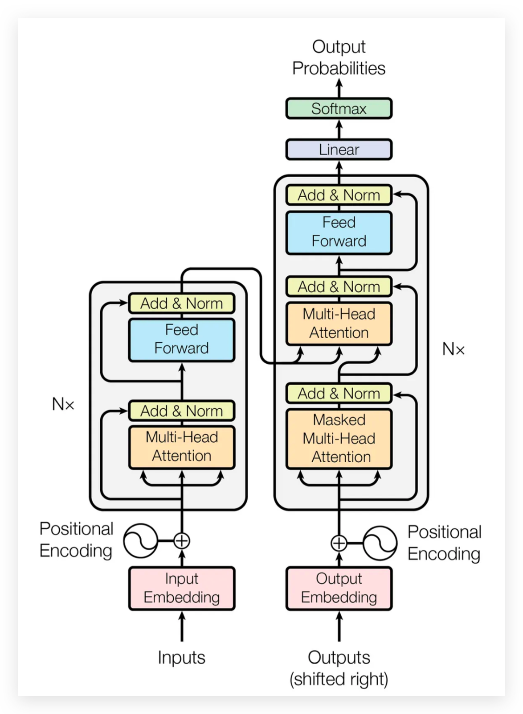

## 前言

<!--more-->

## 背景：为什么需要 Transformer
- 长句子“记不住前面”
- 计算必须按顺序

## 注意力机制 Attention Mechanism

## Transformer架构

## Self Attention

## Multi-Head Attention

## 位置编码 Positional Encoding

--- 
## Encoder & Decoder

## 训练与推理

## 演进与变体

## 小结

## 参考

- [1] https://jalammar.github.io/illustrated-transformer/