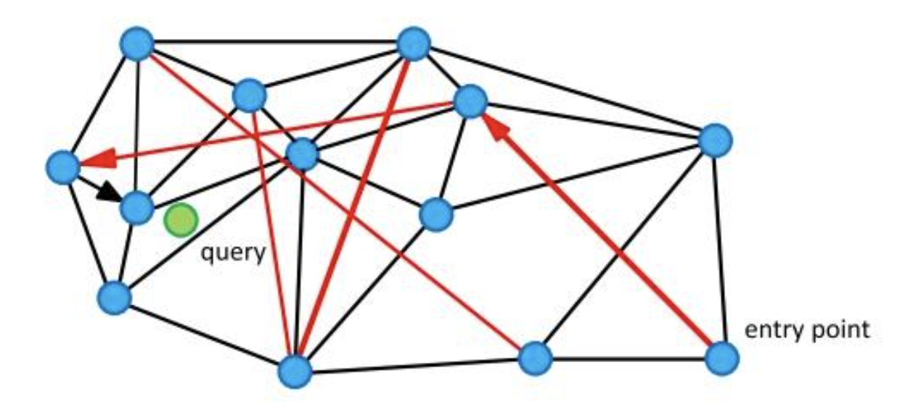

`HNSW（Hierarchical Navigable Small World）是目前最主流的近似最近邻（ANN）索引算法之一，在某种程度上说，没有之一，被 Faiss、Milvus、Weaviate、Qdrant 等主流向量数据库广泛采用。`

<!--more-->

## 背景：为什么需要图索引

在高维向量空间中进行精确最近邻搜索（KNN）的时间复杂度是 O(n·d)，当数据规模达到亿级、维度达到 768/1536 时，“维度爆炸”与数据量带来的距离计算量导致暴力搜索完全不可接受。

> 在现代检索/推荐系统中，留给召回阶段的时间量级通常只有亚毫秒的量级

常见的 ANN 加速方案分三类：

| 方案 | 代表算法 | 优点 | 缺点 |
|------|----------|------|------|
| 基于量化 | PQ、SQ | 内存占用小 | 精度损失较大 |
| 基于树 | KD-Tree、Annoy | 构建快 | 高维退化严重 |
| 基于图 | NSW、HNSW | 精度高、查询快 | 构建慢、内存大 |

HNSW 属于图索引方案，在精度与速度之间取得了最优平衡。

## NSW：可导航小世界图

HNSW 的前身是 NSW（Navigable Small World）。

### 小世界网络

"小世界"来自社会网络理论：任意两个节点之间平均只需很少的跳数就能连通（六度分隔理论）。NSW 将这一思想引入向量检索：

- 每个向量节点与若干邻居相连
- 插入时贪心地连接当前最近的 M 个邻居
- 查询时从入口节点出发，贪心地向目标靠近


*图 1：NSW 可导航小世界图的节点连接结构，每个节点与若干近邻相连，查询从入口节点出发贪心逼近目标*

### NSW 的长短边机制


### NSW 的问题

NSW 的查询复杂度是 O(log n · log n)，但存在一个致命缺陷：**早期插入的节点度数过高**，形成"枢纽节点"，导致查询路径必须经过这些热点，产生瓶颈。

## HNSW：分层解决路由问题

HNSW 由 Malkov & Yashunin 于 2018 年提出，核心创新是**引入分层结构**，将长距离导航与短距离精搜解耦。

### 分层结构

```
Layer 2:  o -------- o              （稀疏，长跳，全局导航）
               |
Layer 1:  o - o - o - o - o        （中等密度）
               |
Layer 0:  o-o-o-o-o-o-o-o-o-o     （稠密，短跳，精确搜索）
```

- **Layer 0**：包含所有节点，连接最近的 2M 个邻居
- **Layer l > 0**：以指数衰减概率随机分配节点，每层连接 M 个邻居
- 节点的最高层级由 `floor(-ln(uniform(0,1)) * mL)` 决定，mL = 1/ln(M)

### 核心参数

| 参数 | 含义 | 典型值 | 影响 |
|------|------|--------|------|
| `M` | 每个节点在非零层的最大邻居数 | 16~64 | 越大精度越高，内存和构建时间增加 |
| `efConstruction` | 构建时动态候选集大小 | 100~500 | 越大构建质量越高，构建越慢 |
| `efSearch` | 查询时动态候选集大小 | 50~500 | 越大召回越高，查询越慢 |

### 构建过程

插入节点 q 的流程：

1. 随机采样 q 的最高层级 `l`
2. 从顶层入口点开始，贪心下降到 `l+1` 层
3. 在第 `l` 层到第 0 层，每层执行：
   - 用 `efConstruction` 大小的候选集找最近邻
   - 用**启发式剪枝**（HNSW heuristic）选出 M 个邻居连接
4. 如果 `l` 超过当前最高层，更新全局入口点

**启发式剪枝**是 HNSW 质量的关键：不只选最近的 M 个，而是确保邻居能覆盖不同方向，避免所有邻居扎堆在同一区域。

### 查询过程

```
1. 从顶层入口点出发
2. 在当前层贪心移动到最近节点（ef=1）
3. 下降到下一层，以上一层结果为起点
4. 在第 0 层用 efSearch 大小的候选集精搜
5. 返回 top-K 结果
```

查询复杂度：**O(log n)**，远优于暴力搜索。

## 内存占用分析

HNSW 的主要代价是内存。每个节点存储邻居列表：

```
内存 ≈ n × M × (层数均值) × sizeof(id)
     ≈ n × M × (1 + 1/mL) × 4 bytes
```

以 1000 万向量、M=16 为例，图结构约占 **~1.2 GB**，加上向量本身（float32 × 768 维）约 **~28 GB**，总计约 30 GB。

## 与其他算法的对比

| 算法 | 查询速度 | 召回率 | 内存 | 适合场景 |
|------|----------|--------|------|----------|
| HNSW | ★★★★★ | ★★★★★ | ★★☆ | 高精度在线检索 |
| IVF-PQ | ★★★★☆ | ★★★☆☆ | ★★★★★ | 超大规模、内存受限 |
| Annoy | ★★★☆☆ | ★★★☆☆ | ★★★★☆ | 只读场景 |
| ScaNN | ★★★★☆ | ★★★★☆ | ★★★☆☆ | Google 场景优化 |

## 工程实践建议

### 参数调优

- **精度优先**：M=32, efConstruction=400, efSearch=200
- **速度优先**：M=16, efConstruction=100, efSearch=50
- **平衡场景**：M=16, efConstruction=200, efSearch=100

### 常见坑

1. **efSearch < K 会报错**：efSearch 必须 ≥ top-K 的 K 值
2. **动态删除代价高**：HNSW 不支持真正删除，只能标记软删除，碎片积累后需重建索引
3. **构建并发度**：构建时多线程加速明显，但要注意内存峰值是最终内存的 1.5~2 倍
4. **向量归一化**：余弦相似度场景记得先 L2 归一化，再用内积距离（IP）代替

### 各数据库的实现

| 数据库 | 实现特点 |
|--------|----------|
| Faiss | 支持 HNSW + PQ 混合，内存效率更高 |
| Milvus | HNSW 支持磁盘化（DiskANN 风格） |
| Weaviate | 原生 HNSW，支持过滤检索 |
| Qdrant | HNSW + 量化，Rust 实现性能强 |
| pgvector | HNSW 支持有限，适合中小规模 |

## 小结

HNSW 通过**分层图结构**将全局导航与局部精搜解耦，实现了 O(log n) 的查询复杂度和极高的召回率，是当前向量检索的事实标准算法。代价是较高的内存占用和较慢的构建速度。

理解 HNSW 的三个核心要素：
- **分层**：解决 NSW 的枢纽节点问题
- **启发式剪枝**：保证图的连通质量
- **efConstruction / efSearch**：构建质量与查询精度的旋钮
